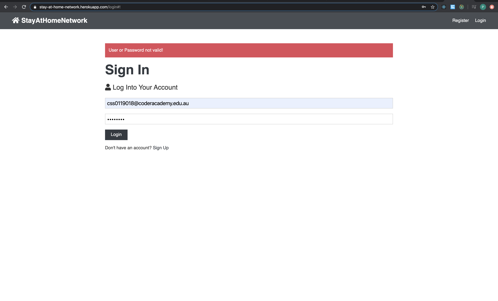

### Code Requirements


**Requirement R4 - Use a recognised task delegation methodology**

In the task delegation plan below, the filled slot indicates the developers working on the task.


**Requirement R5 - Produce a working application that meets user needs**

Stay At Home is a working application that connects people in the neighbourhood to share information about the locality. There is work required in future releases to restrict access to local profiles and blogs. And also add information about the locality using external API's.

**Requirement R6 - Deploy the application to a cloud hosting service**

Deployed the application with both front and backend to Heroku cloud platform using environment variables and MongoDB.

**Requirement R7 - Produce an application with an intuitive user interface**

The style used is similar to most of the websites with navigation bar on the top. There is work required in future versions to make the flow smoother, placement of links better and making the design better. 


**Requirement R8 - *\*Provides evidence of user testing*\*:**

In the development environment

1. Displays the landing page

   Test Case: The landing page is displayed and the redux state values are all empty. The user is not authenticated.

   Status: Pass

   


Also checked the props in development.


2. Register Supporter

Test Case: The user enters data to register.

Status: Failed (A number of actions displayed)


Successfully registered a user.


Checked the database and found the new user.


3. Logout

Test Case: Logout the user. The token should be removed and the user should not be authenticated. The LOGOUT action should be called.

Status: Pass


4. Create Profile

Test Case: Profile should be created successfully

Status: Pass


5. Update Profile

Test Case: Update the profile and add Facebook details.

Status: Pass


Facebook details added successfully.


6. Check Mobile Device

Test Case: Test if the page is displayed on mobile successfully.

Status: Pass 


7. Add Comment

Test Case: Test if a comment can be added.

Status: Pass


Successful addition of the comment.


8. Access Control

Test Case: Test if the delete option is visible to a user who did not add the comment.

Status: Pass


9. Test API

Test Case: Test all endpoints

Status: Pass


Another screenshot with header.


In the production environment

1. Displays the landing page

Test Case: The landing page is displayed and the redux state values are all empty. The user is not authenticated.

Status: Pass


Also checked the props in production.


2. Register User

Test Case: Test if the user can successfully register.

Status: Pass


Registration Successful and redirected to dashboard.


Check the database has the user.


3. Logout

Test Case: Logout and check the LOGOUT action is called and all properties is cleared. 

Status: Pass


4. Invalid Data

Test Case: Enter incorrect data and check if an error message is displayed.

Status: Pass




5. Profile Creation

Test Case: Test if the user can successfully create a profile.

Status: Pass


6. Profile Display

Test Case: Test if profiles are listed

Status: Fail (The images should be displayed from their email profiles. Gravatar package was used to get the images but they are missing.)


7. Individual Profile display

Test Case: A single users profile can be viewed.

Status: Pass


8. Add Blog

Test Case: A blog can be added.

Status: Pass


Blog successfully added.


9. Delete Blog

Test Case: Blog can be deleted.

Status: Fail (Blog deleted but the page did not refresh)


10. Mandatory Field validation

Test Case: When trying to submit null for a mandatory field, an error message is displayed.

Status: Pass


**Requirement R9 - Utilises a formal testing framework**

The main testing frameworks that was used was Jest and Enzyme. 

Jest is included in create react app. Enzyme is a testing utility for react originally from AirBnb. With the rapid upgrade of  React, some of these test have become complicated to use and require work arounds and other mock objects to make it work. All the tests that were tried are in /client/test/src.

To run a react test.

```bash
 % npm test
```

The following code can look for components rendered page. 

```javascript
import React from 'react';
import Enzyme, { shallow } from 'enzyme';
import EnzymeAdapter from 'enzyme-adapter-react-16';
import App from '../App';

Enzyme.configure({ adapter: new EnzymeAdapter() });

/**
 * Factory pattern/function to create a shallow wrapper for the App
 * component. Shallow rendering does not include the child components.
 * @function setup
 * @param {object} propers - Component props for the setup
 * @param {any} state - Initial state for the test set up
 * @returns {wrapper} shallow wrapper is an enzyme class
 */
const setup = (props = {}, state = null) => {
  const wrapper = shallow(<App {...props} />);
  if (state) wrapper.setState(state);
  return wrapper;
};

test('renders without error', () => {
  const wrapper = setup();
  //use debug if the error cannot be figured out
  console.log(wrapper.debug());
  //truthy checks it is not undefined, not null
  expect(wrapper).toBeTruthy();
  //expect(wrapper).toBeFalsy();
});

/**
 * Counts the number of times the component appears.
 */
test('renders Renders BrowserRouter component', () => {
  const wrapper = setup();
  const appComponent = wrapper.find('BrowserRouter');
  //how many nodes are inside this
  expect(appComponent.length).toBe(1);
});

```

The test results on the terminal for the above test.


Change of attributes can be detected by using Enzyme render. The attribute className was changed to class.

```html
 <div class='form-group'> <input type='text' placeholder='* Category' name='category' value={category} onChange={(e) => onChange(e) required />
```

```javascript
import React from 'react';
import Enzyme, { render } from 'enzyme';

import EnzymeAdapter from 'enzyme-adapter-react-16';

import AddExpertise from './AddExpertiseTest';

Enzyme.configure({ adapter: new EnzymeAdapter() });

describe('<AddExpertise />', () => {
  it('renders a div', () => {
    const wrapper = render(<AddExpertise />);
    expect(wrapper.html()).to.contain('div');
  });
});
```

The error displayed on terminal for a test failure.

```javascript
import React from 'react';
import Enzyme, { render } from 'enzyme';

import EnzymeAdapter from 'enzyme-adapter-react-16';

import AddExpertise from './AddExpertiseTest';

Enzyme.configure({ adapter: new EnzymeAdapter() });

describe('<AddExpertise />', () => {
  it('renders a div', () => {
    const wrapper = render(<AddExpertise />);
    expect(wrapper.html()).to.contain('div');
  });
});
```

Test Failure


