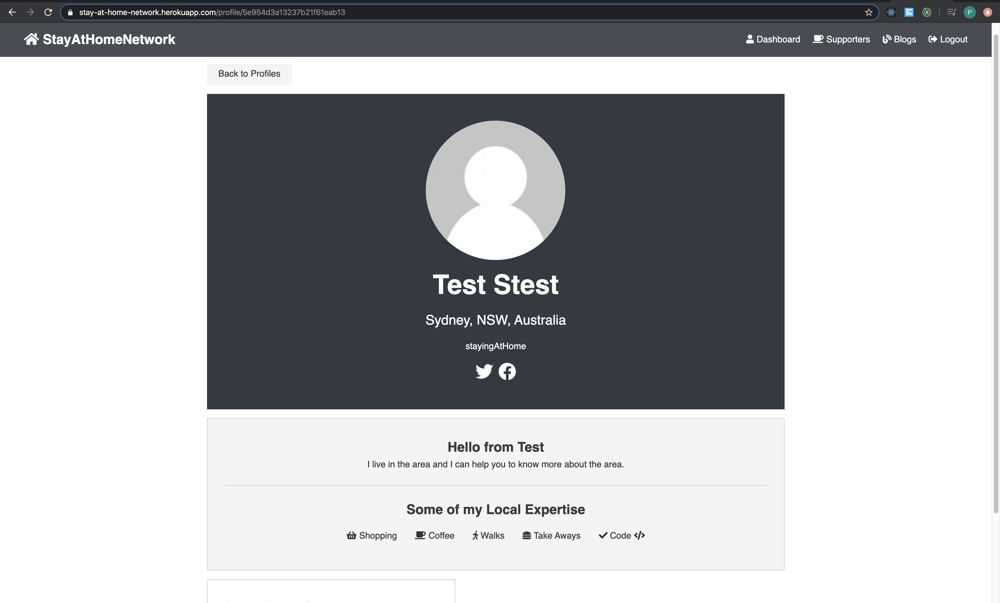

### Code Requirements

**Requirement R8 - *\*Provides evidence of user testing*\*:**

In the development environment

1. Displays the landing page

   Test: The landing page is displayed and the redux state values are all empty. The user is not authenticated.

   Status: Pass

   


Also checked the props in development.


2. Register Supporter

Test: The user enters data to register.

Status: To be reviewed. It should be reviewed because there is a history of actions in the screenshout. It could be developer you has done something like a back on the browser. Retest is required.


Successfully registered


In the production environment

1. Displays the landing page





Requirement R9 - Utilises a formal testing framework**

The main testing frameworks that was used was Jest and Enzyme. 

Jest is included in create react app. Enzyme is a testing utility for react originally from AirBnb. With the rapid upgrade of  React, some of these test have become complicated to use and require work arounds and other mock objects to make it work. All the tests that were tried are in /client/test/src.

To run a react test.

```bash
 % npm test
```

The following code can look for components rendered page. 

```javascript
import React from 'react';
import Enzyme, { shallow } from 'enzyme';
import EnzymeAdapter from 'enzyme-adapter-react-16';
import App from '../App';

Enzyme.configure({ adapter: new EnzymeAdapter() });

/**
 * Factory pattern/function to create a shallow wrapper for the App
 * component. Shallow rendering does not include the child components.
 * @function setup
 * @param {object} propers - Component props for the setup
 * @param {any} state - Initial state for the test set up
 * @returns {wrapper} shallow wrapper is an enzyme class
 */
const setup = (props = {}, state = null) => {
  const wrapper = shallow(<App {...props} />);
  if (state) wrapper.setState(state);
  return wrapper;
};

test('renders without error', () => {
  const wrapper = setup();
  //use debug if the error cannot be figured out
  console.log(wrapper.debug());
  //truthy checks it is not undefined, not null
  expect(wrapper).toBeTruthy();
  //expect(wrapper).toBeFalsy();
});

/**
 * Counts the number of times the component appears.
 */
test('renders Renders BrowserRouter component', () => {
  const wrapper = setup();
  const appComponent = wrapper.find('BrowserRouter');
  //how many nodes are inside this
  expect(appComponent.length).toBe(1);
});

```

The test results on the terminal for the above test.


Change of attributes can be detected by using Enzyme render. The attribute className was changed to class.

```html
 <div class='form-group'> <input type='text' placeholder='* Category' name='category' value={category} onChange={(e) => onChange(e) required />
```

```javascript
import React from 'react';
import Enzyme, { render } from 'enzyme';

import EnzymeAdapter from 'enzyme-adapter-react-16';

import AddExpertise from './AddExpertiseTest';

Enzyme.configure({ adapter: new EnzymeAdapter() });

describe('<AddExpertise />', () => {
  it('renders a div', () => {
    const wrapper = render(<AddExpertise />);
    expect(wrapper.html()).to.contain('div');
  });
});
```

The error displayed on terminal for a test failure.

```javascript
import React from 'react';
import Enzyme, { render } from 'enzyme';

import EnzymeAdapter from 'enzyme-adapter-react-16';

import AddExpertise from './AddExpertiseTest';

Enzyme.configure({ adapter: new EnzymeAdapter() });

describe('<AddExpertise />', () => {
  it('renders a div', () => {
    const wrapper = render(<AddExpertise />);
    expect(wrapper.html()).to.contain('div');
  });
});
```

Test Failure


