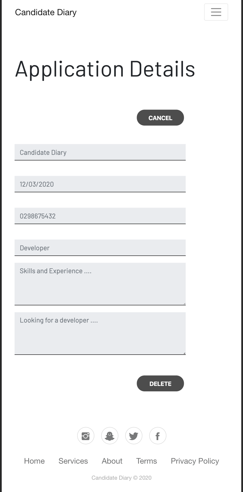

**Requirements - T4A2-A - Full Stack Application - Part A**

-------------------------------------------------------------------------------------------------

**Requirement R1**

Description of your website, including:

**\- Purpose**

The purpose of the **Personal Job Application Management** website is to manage applying for Jobs with self-reliance. The benefit is the clarity confidence that comes from being organised. 

In today’s highly competitive job market, a candidate applies for 50 to 100 roles to find the best suited job. The roles and requirements of each of these jobs are different. 

Apart from the cover letter, each resume used for applying for a job may be different. Why is the resume and cover letter different?

1. Making the filtering of resume easier for the recruitment manager. 
2. Highlighting and providing details of the experience and skills required for the specific role in the resume.
3. Covering the specific details requested in cover letter by the recruitment manager.

What else is important for the candidate?

1. A copy of the job advertisement. The companies remove the job ads once they start the recruitment process.
2. The different roles applied in a company. It is likely the candidate has applied for multiple roles advertised by an employer on different sites. There should be no contradictions between the resumes used for different roles within the same employer. 
3. The candidate has to remember the details of the application even if the employer takes a while to respond to applications.
4. The employer or the company’s profile to know the employer.
5. The up-to-date news about the company.

All the points listed above are highly likely to help the job applicant to manage the job search phase with self-reliance.    

**\- Functionality / features**

1. A responsive website.
2. A Single page application.
3. Registration and Signing in with just the required information.
4. Display of applications grouped by company and option to see the details including advertisement, resume and cover letter.
5. Option to add, retrieve, change and delete application.
6. Links to company information.
7. Link to twitter feed of the company.

**\- Target audience**

The website is best suited for a job applicant who is actively looking for a job and is interested in applying for over five jobs. 

**\- Tech stack**

**Frontend Technologies**: HTML5, CSS, JavaScript

**Frontend Frameworks**: ReactJS

**Backend Technologies**: NodeJS

**Backend Frameworks**: Express

**Database and Database Access Library**: MongoDB, Mongoose (Object Data Modelling Library)

**Cloud Application Platform**: Heroku

-------------------------------------------------------------------------------------------------

**Requirement R2**

Dataflow Diagram

-------------------------------------------------------------------------------------------------

**Requirement R3**

Application Architecture Diagram

-------------------------------------------------------------------------------------------------

**Requirement R4**

User Stories

**Brainstorming**

**Refinement**

**Revision**

-------------------------------------------------------------------------------------------------

**Requirement R5**

Wireframes for multiple standard screen sizes, created using industry standard software

**Index Page Browser**

**Index Page with Expanded Hamburger Menu on Mobile**

**Register User on Browser**

**Register User on Mobile**

**Sign In User on Browser**

**Sign In User on Mobile**

**Add Job Application on Browser**

**Add Job Application on Mobile**

**List of Job Applications on Browser**

**List of Job Applications on Mobile**

**Edit Job Application Details on Browser**

**Edit Job Application Details on Mobile**

**Delete Job Application on Browser**

**Delete Job Application on Mobile**

-------------------------------------------------------------------------------------------------

**Requirement R6**

Screenshots of your Trello board throughout the duration of the project

**Screenshots with Date**

**07 March 2020** 

**09 March 2020**

**10 March 2020 - 11 am**

**10 March 2020 - 4:30 pm**

**11 March 2020**

**12 March 2020**

**13 March 2020**

**14 March 2020**

**16 March 2020**

**17 March 2020**

**20 March 2020**

**21 March 2020**

-------------------------------------------------------------------------------------------------

